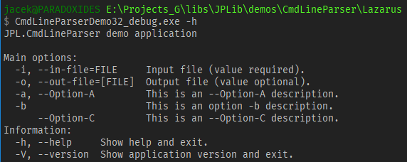
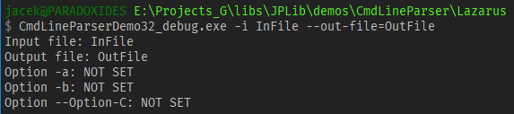
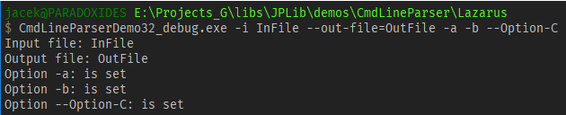
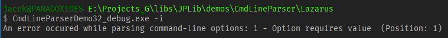

# TJPCmdLineParser demo application


The program demonstrates the use of the **TJPCmdLineParser** class from the **JPL.CmdLineParser** unit.

I use this parser in many applications, including [IniMod](https://github.com/jackdp/IniMod), [PathLocate](https://github.com/jackdp/PathLocate), [DfmExtractor](https://github.com/jackdp/DfmExtractor), [QuickChangeResolution](https://github.com/jackdp/Quick-Change-Resolution).

## Registered options

  ```pascal
  Category := 'main';

  // Short and long option. Value required.
  Cmd.RegisterOption('i', 'in-file', cvtRequired, False, False, 'Input file (value required).', 'FILE', Category);

  // Short and long option. Value optional.
  Cmd.RegisterOption('o', 'out-file', cvtOptional, False, False, 'Output file (value optional).', 'FILE', Category);

  // Short and long option. No value.
  Cmd.RegisterOption('a', 'Option-A', cvtNone, False, False, 'This is an --Option-A description.', '', Category);

  // Short option.
  Cmd.RegisterShortOption('b', cvtNone, False, False, 'This is an option -b description.', '', Category);

  // Long option.
  Cmd.RegisterLongOption('Option-C', cvtNone, False, False, 'This is an --Option-C description.', '', Category);


  Category := 'info';
  Cmd.RegisterOption('h', 'help', cvtNone, False, False, 'Show help and exit.', '', Category);
  Cmd.RegisterOption('V', 'version', cvtNone, False, False, 'Show application version and exit.', '', Category);  
  ```

## Application

### Display help

`CmdLineParserDemo32_debug.exe -h`



### Display version number

`CmdLineParserDemo32_debug.exe --version`


### 2 options with values

`CmdLineParserDemo32_debug.exe -i InFile --out-file=OutFile`



### All options

`CmdLineParserDemo32_debug.exe -i InFile --out-file=OutFile -a -b --Option-C`



### Error

The `i` option is given, but with no value that was required.

`CmdLineParserDemo32_debug.exe -i`



## Source code

```pascal
program CmdLineParserDemo;

{$mode objfpc}{$H+}

uses
  {$IFDEF UNIX}
  cthreads,
  {$ENDIF}
  SysUtils,
  JPL.CmdLineParser;


const
  ENDL = sLineBreak;
  APP_VERSION_STR = '1.0';

var
  Cmd: TJPCmdLineParser;


procedure RegisterOptions;
var
  Category: string;
begin

  {$IFDEF MSWINDOWS} Cmd.CommandLineParsingMode := cpmCustom; {$ELSE} Cmd.CommandLineParsingMode := cpmDelphi; {$ENDIF}
  Cmd.UsageFormat := cufWget;


  Category := 'main';

  // Short and long option. Value required.
  Cmd.RegisterOption('i', 'in-file', cvtRequired, False, False, 'Input file (value required).', 'FILE', Category);

  // Short and long option. Value optional.
  Cmd.RegisterOption('o', 'out-file', cvtOptional, False, False, 'Output file (value optional).', 'FILE', Category);

  // Short and long option. No value.
  Cmd.RegisterOption('a', 'Option-A', cvtNone, False, False, 'This is an --Option-A description.', '', Category);

  // Short option.
  Cmd.RegisterShortOption('b', cvtNone, False, False, 'This is an option -b description.', '', Category);

  // Long option.
  Cmd.RegisterLongOption('Option-C', cvtNone, False, False, 'This is an --Option-C description.', '', Category);


  Category := 'info';
  Cmd.RegisterOption('h', 'help', cvtNone, False, False, 'Show help and exit.', '', Category);
  Cmd.RegisterOption('V', 'version', cvtNone, False, False, 'Show application version and exit.', '', Category);

  // Hidden option.
  Cmd.RegisterShortOption('?', cvtNone, False, True, '', '', Category);

end;

procedure DisplayUsage;
var
  s: string;
begin
  s :=
    'JPL.CmdLineParser demo application' + ENDL + ENDL +
    'Main options: ' + ENDL + Cmd.OptionsUsageStr('  ', 'main', 120, '  ', 30) + ENDL +
    'Information: ' + ENDL + Cmd.OptionsUsageStr('  ', 'info', 120, '  ', 30);
  Writeln(s);
end;

procedure ProcessOptions;
begin
  if (Cmd.IsOptionExists('h')) or (Cmd.IsOptionExists('?')) then
  begin
    DisplayUsage;
    Exit;
  end;

  if Cmd.IsOptionExists('V') then
  begin
    Writeln('Version: ', APP_VERSION_STR);
    Exit;
  end;

  if Cmd.IsOptionExists('i') then Writeln('Input file: ', Cmd.GetOptionValue('i'))
  else Writeln ('Input file: NOT SPECIFIED');

  if Cmd.IsOptionExists('o') then Writeln('Output file: ', Cmd.GetOptionValue('o'))
  else Writeln('Output file: NOT SPECIFIED');

  if Cmd.IsOptionExists('a') then Writeln('Option -a: is set') else Writeln('Option -a: NOT SET');
  if Cmd.IsShortOptionExists('b') then Writeln('Option -b: is set') else Writeln('Option -b: NOT SET');
  if Cmd.IsLongOptionExists('Option-C') then Writeln('Option --Option-C: is set') else Writeln('Option --Option-C: NOT SET');
end;


begin

{$IFDEF FPC}
  {$IF DECLARED(UseHeapTrace)}
	GlobalSkipIfNoLeaks := True; // supported as of debugger version 3.2.0
  {$ENDIF}
{$ENDIF}

  try

    Cmd := TJPCmdLineParser.Create;
    try

      RegisterOptions;

      if ParamCount = 0 then
      begin
        DisplayUsage;
        Exit;
      end;

      Cmd.Parse;

      if Cmd.ErrorCount > 0 then
      begin
        Writeln('An error occured while parsing command-line options: ', Cmd.ErrorsStr);
        ExitCode := 1;
        Exit;
      end;

      ProcessOptions;


      // Do something ...


    finally
      Cmd.Free;
    end;

  except
    on E: Exception do
      Writeln(E.Message);
  end;

end.
```
