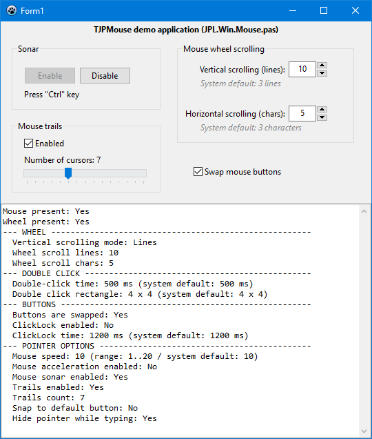

# TJPMouse demo application

The program demonstrates the use of the **TJPMouse** class from the **JPL.Win.Mouse** unit.

I used TJPMouse class in the [WinMouse](https://www.pazera-software.com/products/winmouse/) program.
